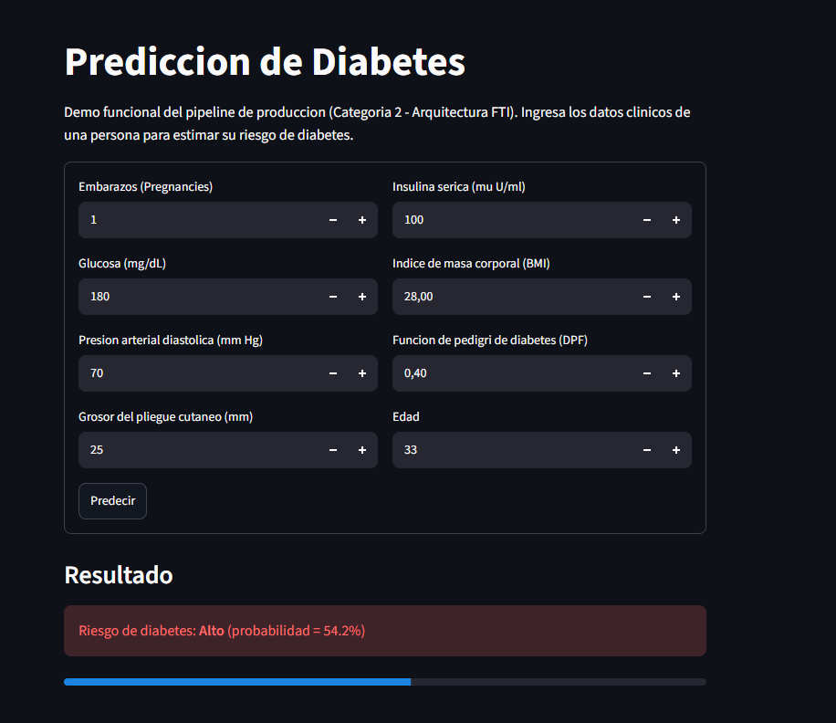
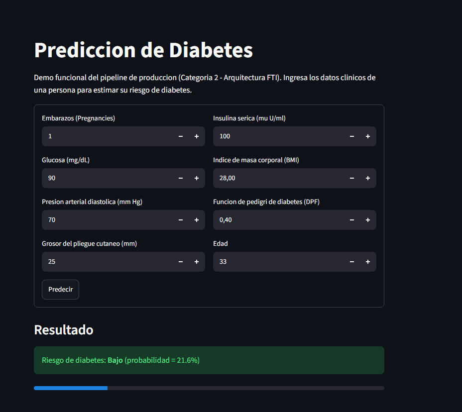

# Demo Online - Prediccion de Diabetes (Categoria 3, Tarea 1)

Demo interactiva construida con Streamlit que usa el **pipeline de produccion**
entrenado en la Categoria 2 (Arquitectura FTI): `data/06_models/pipeline_produccion_random_forest.joblib`,
cargado y validado a traves de `src/inference/predict.py` y `src/data/validation.py`
(validacion de esquema con Pandera antes de predecir).

A diferencia del demo de la Tarea 8 (Categoria 1, `notebooks/7-deploy/app_streamlit.py`),
que usa el modelo POC con logica de transformacion manual, esta app reutiliza
directamente el codigo ya testeado de la arquitectura FTI: la imputacion,
transformacion log1p y escalado estan dentro del propio pipeline `.joblib`.

## URL publica

<https://diabetes-ypmdfjjvsfh7jn4oyp8fna.streamlit.app/>

## Como ejecutarla localmente

Desde la raiz del repositorio:

```bash
uv sync
uv run streamlit run streamlit_app.py
```

Se abre automaticamente en `http://localhost:8501`.

## Screenshots

**Riesgo alto** (Glucose=180, resto de valores tipicos):


**Riesgo bajo** (Glucose=90, resto de valores tipicos):


## Notas tecnicas

- El modelo se cachea con `@st.cache_resource`.
- La validacion de los datos de entrada usa `ESQUEMA_INFERENCIA` (Pandera),
  el mismo esquema que usa `src/pipelines/inference_pipeline` para lotes.
- La prediccion usa el umbral por defecto de `predict()` (0.5), tal como
  esta implementado en `src/inference/predict.py` (Categoria 2) — no se
  reintroduce el umbral optimizado de 0.436 de la Tarea 8, para mantener
  consistencia con el codigo de produccion ya testeado.
