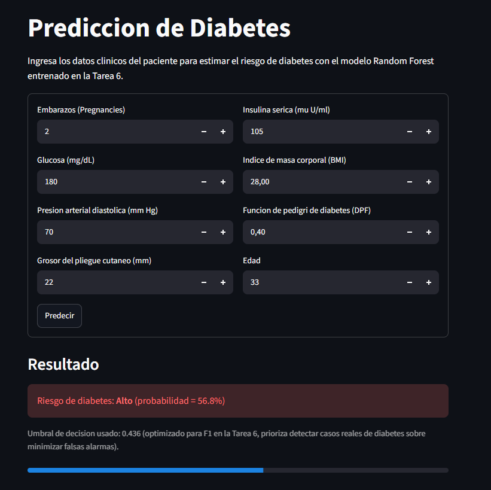
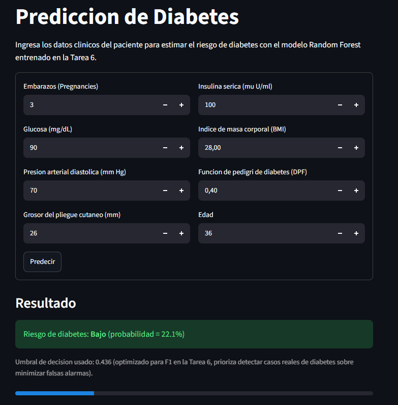

# Demo Funcional - Prediccion de Diabetes

Demo interactiva construida con Streamlit que carga el modelo Random Forest
final (Tarea 6, `data/06_models/modelo_final_random_forest.joblib`) y
permite ingresar los datos clinicos de un paciente para predecir el riesgo
de diabetes.

## Como ejecutarla

Desde la raiz del repositorio:

```bash
uv sync
uv run streamlit run notebooks/7-deploy/app_streamlit.py
```

Se abre automaticamente en el navegador en `http://localhost:8501` (si no,
abrelo manualmente).

## Screenshots

**Riesgo alto** (Glucose=180, resto de valores tipicos):


**Riesgo bajo** (Glucose=90, resto de valores tipicos):


## Notas tecnicas

- El modelo se cachea con `@st.cache_resource` para evitar recargarlo en
  cada interaccion del usuario.
- `Insulin` y `DiabetesPedigreeFunction` se transforman con `log1p` antes
  de predecir, igual que en el pipeline de entrenamiento (Tarea 4) — el
  modelo espera esas variables ya transformadas.
- El umbral de decision usado es 0.436 (optimizado por F1 en la Tarea 6),
  no el 0.5 por defecto de `predict()`.
- Los campos del formulario tienen minimos mayores a 0 para evitar el
  problema de "ceros disfrazados como datos faltantes" identificado en la
  Tarea 1 (el pipeline guardado no incluye un imputador).
